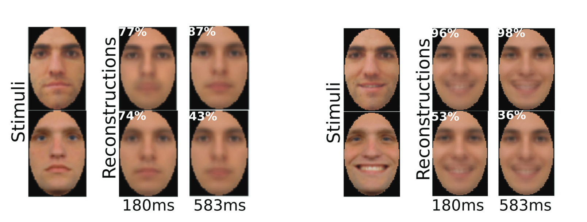
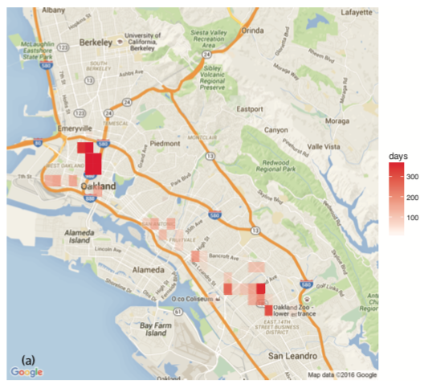

---?image=images/sauron.png&size=auto 100%
<h1 style="color: white" class="fragment"> How to Reach the Star Trek Singularity </h1>

+++

> It’s the moment where we decide that human dignity is of paramount importance, and we learn how to use technology to enhance human experience

Cathy O'Neil |

Note:

In short, the Star Trek Singularity is a utopian future where we have technology, specifically digital technology, that works for and prioritizes the wellbeing of **all people**.

This is a phrase coined by Cathy O'Neil in an article published in [Bloomberg](https://www.bloomberg.com/view/articles/2018-02-21/virtual-reality-could-erase-the-limits-of-inequality) a few months back. She's a data scientist by trade, and author of the book, *Weapons of Mass Destruction*. I'd highly recommend to anyone from a technical or non-technical background, and many of the examples I'll talk about come from her book.

+++

## But Why, Joe?

Note:

Now, before I jump into the meat of the talk, I want to explain why I think it's worth talking about, and why I'm personally interested in it. And the most recent Stack Overflow Developer Survey can help illustrate why 

Some months back, at the beginning of 2018, Stack Overflow released their survey results they gathered from >100,000 developers, designers, data scientists, product managers, etc. And this year, they had a section on technology and society. So let's look at a few questions real quick

+++

[Stack Overflow 2018 Annual Developer Survey](https://insights.stackoverflow.com/survey/2018/#technology-and-society)

Note: 

Takeaway:

Most respondents feel that developers do have an obligation to consider the ramifications of their code, but a surprising 1/5 of respondents either disagree or don't know.

+++

[Stack Overflow 2018 Annual Developer Survey](https://insights.stackoverflow.com/survey/2018/#technology-and-society)

Note:

Takeaway:

The question of who's responsible for unethical code is seemingly disputed. I realize the question uses the phrase *most responsible*, but this still illustrates that blame and responsibility are tough to pin down

+++

[Stack Overflow 2018 Annual Developer Survey](https://insights.stackoverflow.com/survey/2018/#technology-and-society)

Note:

Takeaway:

Roughly 1/4 of respondents think the creators, inventors, or designers of their AI technology are **not** most responsible for the ramifications. And that really worries me. 

+++

## As for Me

Note:

Exploring the intersection of technology and society is something I'm obsessed with. I see far too many cases of companies and governments using digital technology to get away with murder (both metaphorically, and in some cases, literally).  

**PAUSE** 

There's a lot of content I want to get through, but my hope is that by drawing on perspectives in law, philosophy, sociology, politics, psychology, technology, and other domains, there's a little bit of something in here for everyone. And if all else fails, I've thrown in an exorbitant number of gifs, so it should at the very least be entertaining. 

+++

## Keep in Mind...

+++

Note:

Despite my lack of faith in the general humanity of the developed world, I love technology and think it can contribute more good than harm, if wielded with empathy and compassion. I'm a software engineer by trade, so if I had to wear a full-sized tin foil hat, I would probably be unemployed.

+++

Note:

I'm young...**somewhat** optimistic, and know very little about the world.

+++

Note: 

I will doing a little moral finger-wagging throughout this talk; however, I want this to be more of a conversation about the concerning trends I see, rather than me ranting in front of a room filled with people who have significantly more technical and business competence that I do. I understand and see the irony there.

+++

Note:

And finally, keep in mind that almost all of this will be **my** opinion, but I will be referencing studies, books (*raise books here*), and articles. I've done my best to cite every fact, statistic, and quote I use. If anyone ever stops to think, *Mmmmm, but is that really true?*, feel free to stop me and I can go in more depth on an idea, statistic, or study.

---

## Broad Outline

* What is Technology? |
* All Hail the Data Lords |
* The Subtle, Not-So-Subtle Harms of Our Digital World | 
* So How Do we Reach the Star Trek Singularity? | 
* Cool, but What About Slalom? |

Note:

1. I'll try to debunk the idea that "technology is neutral, it's how you use it that makes it good or bad", and make it clear how I think we ought to think of this term. This will also drive further arguments about responsibility and culpability.
2. I'll explore the current state of data mining, profiling, and surveillance in both the public and private spheres. I'll detail how the overlap between the two make the term "Orwellian" largely insufficient in describing the current climate
3. I'll talk through what I see as some of the most worrying trends in digital technology. 
    * These will be trends that affect and harm all of us at different levels: individually, communally, nationally, internationally
    * These examples will be almost entirely software focused, but there are discussions--equally important--on things like e-waste, that fall under this category
4. I'll grapple with what I believe are the best ways we can mitigate harm and empathize our digital world: as individuals, as a community, and as an increasingly globalized society
5. I'll talk about the ways in which these trends potentially impact Slalom's business; how we could evangelize best practices around data ethics (and even turn this into potential client projects); and discuss ways we can position ourselves at the forefront of this critical discussion

+++

## One Last Disclaimer

I won't be talking about

* Workforce automation |
* Accessibility in design |
* Video games |
* The singularity |

Note:

* Workforce automation
* Accessibility in design (mainly because I don't think I can talk intelligently to this topic)
* Video games
* The singularity

Decided to keep these out to narrow the scope of the presentation, and/or because I didn't feel as though I could give these topics proper justice

---

## Technology

+++

### In the Before Times...

> **Techne**: (n.) art or craft-knowledge. The body of knowledge associated with a particular practice of making... 

* A carpenter’s *techne* of making objects from wood |
* A farmer’s *techne* of working the land |
* A statesman’s *techne* of governing a state or polis |

[*Philosophy of Technology*, Internet Encyclopedia of Philosophy](http://www.iep.utm.edu/technolo/#H1) |

Note:

In classic Greek philosophy, technology was thought of as an act, an art, and a craft. The "art of making involved both reflection on human action and...what the world was like." Both Aristotle and Plato thought of technology as the "idea of man imitating nature"

+++

### Nowadays...

Note:

During the Middle Ages, technology was reframed as more prospective: "authors began to consider craftsmanship as being more than...the imitation of nature’s works...[rather], humans were also capable of improving upon nature’s designs". Today, the relationship between technology and science has become ever-intertwined, and we should understand that there are a few key components. Technology:

* As prospective (Henryk Skolimowski)
* As an act and a decision grounded by scientific knowledge/theory (Mario Bunge)
* Engagement with ethics (Herbert Simon)

+++

Henryk Skolimowski (*Technology and Culture*, 1966):
  > science concerns itself with what is, whereas technology concerns itself with **what is to be** |

[*Philosophy of Technology*, Stanford Encyclopedia of Philosophy](https://plato.stanford.edu/entries/technology/#IntTecSci
)

+++

Mario Bunge (1966):
  > technology is applied science...technology is **about action**, but an action heavily underpinned by theory—that is what distinguishes technology from the arts and crafts and puts it on a par with science |

[*Philosophy of Technology*, Stanford Encyclopedia of Philosophy](https://plato.stanford.edu/entries/technology/#IntTecSci
)

+++

Herbert Simon (*The sciences of the artificial*, 1969) |
  > the scientist is concerned with how things are but the engineer with how things **ought** to be |

[*Philosophy of Technology*, Stanford Encyclopedia of Philosophy](https://plato.stanford.edu/entries/technology/#IntTecSci
)

Note: 

**PAUSE**

And I know what you might be thinking...

+++

Note:

SO WHAT?

+++

### Here's the Thing

I often hear that Technology is

* A thing, a tool |
* Neutral; it's how you use it that makes it good or bad |

Note:

I firmly believe this thinking is dangerous and misinformed. Even if you think of technology as an artifact of a process--instead of a whole process--that artifact has the values, objectives, and motivations of their creators in it. 

Think of scissors. They're boring, but they're a technology. Talk to anyone who's left-handed, they will adamantly tell you scissors make *assumptions* that they **do not** like.

+++

### The Reality?

Technology is **not** ethically or morally neutral. |

As technologists, we're in the business of ethics. |

> Technology is an ongoing attempt to bring the world closer to the way one wishes it to be...technology aims to change the world. |

[*Philosophy of Technology*, Stanford Encyclopedia of Philosophy](https://plato.stanford.edu/entries/technology/#IntTecSci
) |

Note:

Technology is an exercise of judgement, of action, and assumes an understanding of our world. This belief that technology is neutral creates a culture where its creators, designers, and participants aren't held accountable, and asking if something ought to be created in the first place, if the question is even asked, is far too often an afterthought.

---

## Our Data Lords

* How are they regulated? |
* What is the state of public surveillance? |
* What is the state of private surveillance? | 

Note:

An understanding of the current landscape of data mining and surveillance helps quantify the magnitude and scope of digital harms--both public and private. I'll break this section down into three parts:

* U.S. data protection legislation & GDPR
* State of public surveillance
* State of private surveillance

+++

### Regulatory Environments

* U.S. |
* E.U. General Data Protection Regulation (GDPR) |

+++

#### U.S.

To date, the U.S. has no comprehensive legislation protecting individual data rights; however, there is  some segmented legislation: |

* GLBA |
* FERPA |
* COPPA |
* HIPPA |
* FCRA & ECOA |

Note:

1. [Gramm-Leach-Bliley Act: companies that offer consumers financial products or services like loans, financial or investment advice, or insurance must explain their information-sharing practices to their customers and to safeguard sensitive data](https://www.ftc.gov/tips-advice/business-center/privacy-and-security/gramm-leach-bliley-act)(https://csrc.nist.gov/projects/risk-management/detailed-overview)
2. [Family Educational Rights and Privacy Act: protects the privacy of student education records](https://csrc.nist.gov/projects/risk-management/detailed-overview)
3. [Children's Online Privacy Protection Act: prohibits unfair or deceptive acts or practices in connection with the collection, use, and/or disclosure of personal information from and about children on the Internet](https://www.ecfr.gov/cgi-bin/text-idx?SID=4939e77c77a1a1a08c1cbf905fc4b409&node=16%3A1.0.1.3.36&rgn=div5)
4. [Health Information Privacy and Portability Act: rights over your health information and sets rules and limits on who can look at and receive your health information](https://www.hhs.gov/hipaa/for-individuals/guidance-materials-for-consumers/index.html)
5. Fair Credit Reporting Act guarantees that a consumer can see the data going into their score and correct any errors, and the Equal Credit Opportunity Act prohibits linking race or gender to a person's score

I assume this isn't a comprehensive list of all laws in the U.S. that deal with data ethics, but the point is: U.S. law boils down to a legal philosophy of: *collect whatever data you want, unless otherwise prohibited by law*

The recent adoption of the GDPR legislation in the E.U., however, is based on a different philosophy. By default, *you are not allowed to collect any data, unless explicitly allowed by law*. I should also note that Russia has had similar legislation since 2006. I won't go into that law today, but I thought it was worth mentioning. We may have more olympic medals, but they've got more comprehensive legislation around data ethics. Just saying.

+++

#### E.U.

GDPR "important" chapters

  2. Principles
  3. Rights of the Data Subject
  4. Controller and Processor

[European Commission](https://ec.europa.eu/info/law/law-topic/data-protection_en)

Note:

1. Conditions for consent, consent for children, special categories of data, data for criminals, suspects, etc.
2. The rights to your data
3. Collectors of data, and how that data is used (processors)

+++

#### Data Subject Rights

* Notice (where, how your data is/was collected, and for what purposes) |
* Access (to yo data) |
* Rectification (correct erroneous data) |
* Erasure (right to be forgotten) |
* Blocking (restricting processing) |
* Data portability |
* Right to object |
* Right to be free from automated decision-making and profiling |

[European Commission](https://ec.europa.eu/info/law/law-topic/data-protection_en)

+++

#### Controller and Processor Responsibilities

+++

Controllers are responsible for 

> Taking into account the nature, scope, context and purposes of processing as well as the risks of varying likelihood and severity for the rights and freedoms of natural persons

* Pseudonymisation (artifical identifiers) |
* Data minimization |
* Collect only what is needed, for the minimal extent of processing, storage, and accessibility |

[GDPR, Articles 24-25](https://gdpr-info.eu/)

+++

> processing will...ensure the protection of the rights of the data subject

Requirements include:

* pseudonymisation, encryption of personal data |
* ensuring integrity, availability, and resilience of systems and services (build a good system) |
* ability to restore systems in timely manner (again, make it good) |

+++

* regular testing of effectiveness and security (seriously, make a decent system) |
* obligation to report data breach to relevant authority AND data subject (looking at you, Equifax) |

[GDPR, Articles 28, 32](https://gdpr-info.eu/)

+++

#### TL;DR

GDPR focuses on specifying the 

* what (gets collected/processed), | 
* how (data are collected/processed), | 
* when (data were collected/processed), |
* who/where (provided/processed data), and | 
* why (collection/processing purposes, longevity, etc.) |

+++

for protecting 

> fundamental rights and freedoms of natural persons and in particular their right to the protection of personal data

[GDPR, Article 1](https://gdpr-info.eu/art-1-gdpr/)

+++

Note: 

And here's a key takeaway: establishing the protection of personal data as a human right is a rather novel development in thinking. It's important to think of data less of a what, and more of a who. Our data is increasingly becoming existential--that is, part of what it means to exist in our digital world

+++

#### Violations

* Fines up to the greater of €20MM or 4% of global revenue (for violations of data subject rights, basic principles for processing)

[GDPR, Article 83](https://gdpr-info.eu/art-83-gdpr/)

+++

### Public Surveillance

Note:
By far, the NSA has the broadest and most sophisticated surveillance technology of any institution in human history. I'll talk more about surveillance in China and the U.S.

+++

#### China

Currently,

* Chinese government maintains every individual's **dang’an**, "the personal file containing every scrap of information the state keeps on them, from exam results to their religious and political views" | 
* Police are experimenting with smart glasses to identify criminals in crowds in real-time |
* Classrooms are experimenting with facial recognition software to grade students based on their facial expressions |

Note:

[Dang'an](https://newrepublic.com/article/148121/control-14-billion-people)

[Allegedly able to scan a face real-time against a database of 10,000 faces in 1/10 of a second. Currently deployed in Zhengzhou. Police are able to track and surveil citizens with "complete freedom"](https://www.theverge.com/2018/2/8/16990030/china-facial-recognition-sunglasses-surveillance)

[A highschool in east China installed a "smart eye" system. Every 30 seconds the system looks at students faces & actions, then gives an automated score](https://futurism.com/smart-eye-china-facial-recognition/)

+++

* Workplaces are experimenting with brain-scanning helmets to monitor emotional states of workers |

In 2020,

* Every citizen will have a mandatory "social credit score" |

Note:

[Workplace helmets](https://www.technologyreview.com/the-download/611052/with-brain-scanning-hats-china-signals-it-has-no-interest-in-workers-privacy/)

[Chinese social credit scheme will rate citizens based on "commercial sincerity", "social security", "trust breaking", and "judicial credibility"](https://newrepublic.com/article/148121/control-14-billion-people)

+++

[*The Neural Dynamics of Facial Identity Processing: insights from EEG-Based Pattern Analysis and Image Reconstruction*
Dan Nemrodov, Matthias Niemeier, Ashutosh Patel, Adrian Nestor
eNeuro 29 January 2018, ENEURO.0358-17.2018](http://www.eneuro.org/content/early/2018/01/29/ENEURO.0358-17.2018) |

Note:

And if you think eeg technology is still nascent, it is. But in a 2018 study published by researchers at the University of Toronto, EEG readings can already be used to re-create digital images from brain scans

+++

Note:

You might think *Well, I'm glad I don't live in China*. But let's also consider why the Chinese might also think *gee, I'm glad I don't live in the U.S.*

+++

#### U.S. 

NSA can |

* Collect 200 million texts a day |
* Track international financial payments | 
* Collect data on "nearly everything a user does on the internet" |
* Grab data directly from the major tech giants (Google, Apple, IBM, Verizon, Yahoo, Facebook, etc.) |

Note:

I'll detail some of the most worrying surveillance tactics the NSA uses (we know most of this through Snowden's leaked documents to media outlets). Many of these examples are a little dated, which to me also suggests that there's likely even more sophistication at this point. 

This isn't comprehensive by any means either.

1. As [BBC News reported in 2014](https://www.bbc.com/news/world-us-canada-25770313), the NSA "has collected and stored almost 200 million text messages a day from around the world"
2. As [Der Spiegel reported in 2013](http://www.spiegel.de/international/world/spiegel-exclusive-nsa-spies-on-international-bank-transactions-a-922276.html), the NSA "widely monitors international payments, banking and credit card transactions" through a program called Follow the Money
3. As [the Guardian reported in 2013](https://www.theguardian.com/world/2013/jul/31/nsa-top-secret-program-online-data), the NSA can collect "nearly everything a user does on the internet", including emails, social media activity, and browsing history using a tool called XKeyscore. And oh by the way, they need no prior authorization
4. As the [Washington Post reported in October 2013](https://www.washingtonpost.com/world/national-security/nsa-infiltrates-links-to-yahoo-google-data-centers-worldwide-snowden-documents-say/2013/10/30/e51d661e-4166-11e3-8b74-d89d714ca4dd_story.html?utm_term=.17c5f853d34a):

> Under PRISM, the NSA gathers huge volumes of online communications records by legally compelling U.S. technology companies, including Yahoo and Google, to turn over any data that match court-approved search terms

+++

[United States Courts Statistics & Reports](http://www.uscourts.gov/statistics-reports/analysis-reports/delayed-notice-search-warrant-report) |

Note: 

Any you might think, awesome! They have to get a court's approval, meaning there's accountability and transparency in the system right? That won't be abused. 

Well, let's take a look at Section 213 of the Patriot Act, the section that established and normalized the usage of Delayed-Notice Warrants, or as they're more colloquially known as, Sneek-and-Peek warrants. As the Electronic Frontier Foundation explained in a 2014 report:

> Proponents of Section 213 claimed [these] warrants were needed to protect against terrorism

If you suspect someone is a terrorist, not informing them that you were searching or seizing their property would help you in the name of public security. This was needed to stop *terrorism*, and wouldn't be used for anything else. 

Well, as it turns out, it's overwhelmingly not used for terrorism. The latest statistics--which are publicly available--showcase intelligence and security enforcement agencies in the U.S. use these warrants for anything but terrorism cases.

+++

Note:

But this trend isn't limited to the Patriot Act, either. Technologies like facial recognition are also widely used by federal, state, and local law enforcement agencies for surveillance. As the [Center on Privacy & Technology at Georgetown Law](https://www.perpetuallineup.org/) explains in their 2016 report:

+++

> 16 states let the FBI use face recognition technology...One in two American adults is in a law enforcement face recognition network...No state has passed a law comprehensively regulating police face recognition.

[Center on Privacy & Technology at Georgetown Law](https://www.perpetuallineup.org/)

Note:

The takeaway? While I've only talked briefly about surveillance by U.S. and Chinese governments, the reality is that public surveillance and data mining of almost everything we do has become so widespread that the term Orwellian is now insufficient in describing our current world

+++

### Private Data Mining

Note:

Now let's look at the scale of data collection and profiling done by private corporations.

+++

#### Web-based Tracking

> based on a crawl of the top 1 million websites...We make 15 types of measurements on each site, including stateful (cookie-based) and stateless (fingerprinting-based) tracking |

[Englehardt, Steven. Narayanan, Arvind. *Online tracking: A 1-million-site measurement and analysis*. Princeton University. October 2016.](https://webtransparency.cs.princeton.edu/webcensus/) |

+++

+++

The takeaways?

> Within samples of over 100,000 browsers, 80-90% of desktop and 81% of mobile device fingerprints are unique |

>  we find that the vast majority of top third parties sync cookies with at least one other party: 45 of the top 50, 85 of the top 100 |

+++

But wait, there's more!

+++

> Our crawler visited 15,700 sites and attempted to sign up for emails on each of these. |

[Englehardt, Steven. Han, Jeffrey. Narayanan, Arvind. *I never signed up for this! Privacy implications of email tracking*. Princeton University. September 2017.](https://senglehardt.com/papers/pets18_email_tracking.pdf) |

Note: 

Those same researchers, and another, Jeffrey Han, did another study a year later on email tracking.

+++

What did they find?

> 85% of emails in our corpus contain embedded third-party content, and 70% contain resources categorized as trackers by popular tracking-protection lists. There are an average of 5.2 [per email]

+++

> About 29% of emails leak the user’s email address to at least one third party when the email is opened, and about 19% of senders sent at least one email that had such a leak. The majority of these leaks (62%) are intentional | 

+++

But Joe, what about mobile apps?

+++

>  an empirical study of the prevalence of third-party trackers on 959,000 apps from the US and UK Google Play stores

>  Across all analyzed apps (n = 959,426), the median number of tracker hosts included in the bytecode of an app was 10. 90.4% of apps included at least one, and 17.9% more than twenty

[*Third Party Tracking in the Mobile Ecosystem*. University of Oxford. April 2018](https://arxiv.org/pdf/1804.03603.pdf) |

Note: 

Researchers from Oxford University just over a month ago analyzed ~1 million mobile apps on the Google Play store, and found third-party tracking to be rampant across multiple apps

+++

+++

+++

Ok, but what about the children?

+++

* Researchers analyzed ~6,000 free children's apps (total install count of 4.5B by users in app store) |
  * Majority are in potential violation of COPPA |
* Google is weak sauce |
* 73% sent sensitive information without parental consent |

[*'Won’t Somebody Think of the Children?' Examining COPPA Compliance at Scale*. International Computer Science Institute, March 2018](https://petsymposium.org/2018/files/papers/issue3/popets-2018-0021.pdf)

Note:

In a research paper literally titled "What About the Children?",

> Based on our automated analysis of 5,855 of the most popular free children’s apps, we found that a majority are potentially in violation of COPPA...
> efforts by Google to limit tracking through the use of settable advertising IDs have had little success: of the 3,454 apps that share the resettable ID with advertisers, 66% transmit other, non-resettable, persistent identifiers as well, negating any intended privacy-preserving properties of the advertising ID...
> observed that 73% of the tested applications transmitted sensitive data over the Internet...none of these apps attained verifiable parental consent

+++ 

* If there's time, I'll come back and talk about Intellectual Imperialism with Internet.org, Facebook's initiative

[Quartz Magazine](https://qz.com/333313/milliions-of-facebook-users-have-no-idea-theyre-using-the-internet/)

> In India, you can get a Facebook-only data plan for $2.50 a year (the cheapest full data plans cost about $10 a year.) In the Philippines, Facebook-only plans cost a fifth as much as data plans.

+++

> Okay cool, everybody tracks me, so what? "Free" services are so convenient, it's a worthy cost to give up for the benefits. And ads are just a nuisance, are they really all that bad? |

Note:

Now, the glaring question here is:

And while I have a response to that question, there's still some content I want to get through before I revisit that

+++

### The Unholy Matrimony of Both

+++

* Google has a contract with the DoD to develop uses for its AI technology with drones [Gizmodo](https://gizmodo.com/google-is-helping-the-pentagon-build-ai-for-drones-1823464533)

* Palantir won a $42MM contract from the U.S. government to build out Trump's wide-scale monitoring of immigrants [The Intercept](https://theintercept.com/2017/03/02/palantir-provides-the-engine-for-donald-trumps-deportation-machine/)

* Amazon is working with police departments to integrate their Rekognition API in body and street cameras [Futurism](https://futurism.com/police-surveillance-gets-terrifying-boost-from-amazons-ai-facial-recognition/)

* Predictive policing software is encouraged and financed by initiatives from the federal Bureau of Justice Assistance’s SMART Policing Initiative [The Intercept](https://theintercept.com/2018/05/11/predictive-policing-surveillance-los-angeles/)

+++

Note:

Now I'll do a more quantitative and qualitative analysis of digital harm. And it's going to get worse before it gets better. Don't worry.

---

## The Harms in our Digital World 

* Social Media, Politics, and the Automation of Marginalization |
* Build It and They Will Come |
* Informed Consent, Transparency, and Accountability |
* ~~Don't Get High on Your Own Supply~~ |

Note:

1. How does social media impact how we communicate and interact? How does this inform politics, and how can digital technology reinforce biases like sexism, racism, and classism? It's often easy to think of diversity as a "nice to have", but I want to materialize the *specific* harms of the lack of diversity in tech: exciting technologies like machine learning, computer vision, and predictive analytics can further harm marginalized groups of people at a devastating scale
2. Most of us have likely heard Facebook's famous mantra, **move fast and break things**. This mindset of **build first, ask questions later** is irresponsible, dangerous, and a key culprit of why we see so many apologies from tech executives after-the-fact
3. The complexity and ubiquity of our smart, always-on technology revolutionizes communication and offers more convenience than ever thought possible. But it also challenges our notion what informed consent means in a digital world, delivers "free" services in an environment with little accountability and transparency, and offers almost no redress when things go wrong. 
4. How the technology we build affects our
    * attention
    * critical thinking
    * creativity, and
    * emotional intelligence as a species
    * And finally, why we ought to treat tech addiction more seriously, even as "digital heroin"

---

## Social Media, Politics, and the Automation of Marginalization

+++

Social media

* Creates echo chambers, reinforcing biases |
* Incentivizes extreme, polarizing communication |
* Enhances our punitiveness |
* May be contributing to a swath of alarming mental health developments |

+++

[Bastos, Marco & Mercea, Dan & Baronchelli, Andrea. (2017). *The Spatial Dimension of Online Echo Chambers*.](https://www.researchgate.net/publication/319875662_The_Spatial_Dimension_of_Online_Echo_Chambers?enrichId=rgreq-3c9d236adebda3cd53424db08698189e-XXX&enrichSource=Y292ZXJQYWdlOzMxOTg3NTY2MjtBUzo1NjkyNjEyOTQ4Nzg3MjBAMTUxMjczMzg3Nzc2MA%3D%3D&el=1_x_3&_esc=publicationCoverPdf) |

Note:

Technology was thought of as democratizing, bringing people together from all walks of life over shared views, opinions.

In practice, this may not be the case.

Researchers from the University of London looked at UK users' tweets during the Brexit referendum, and analyzed tweets by users who aligned themselves with either the stay or leave campaign

**SHOW PICTURE, discuss**

+++

* [J. Crockett, M. (2017). *Moral outrage in the digital age*. Nature Human Behaviour. 1. 10.1038/s41562-017-0213-3.](https://static1.squarespace.com/static/538ca3ade4b090f9ef331978/t/5a53c0d49140b7212c35b20e/1515438295247/Crockett_2017_NHB_Outrage.pdf)
* [William J. Brady, Julian A. Wills, John T. Jost, Joshua A. Tucker, Jay J. Van Bavel. *Moral contagion in social networks*. Proceedings of the National Academy of Sciences Jul 2017, 114 (28)](http://www.pnas.org/content/114/28/7313)

Note:

Why is this important? Well, as the authors observe,

> As polarization rises, cooperation to reach cross-ideological and agreeable outcomes becomes increasingly less likely

And this is largely by design,

M.J. Crockett, researcher at Oxford University, explains:

> social media apps streamline triggering stimuli and available responses into a heavily designed ‘stimulus–response–outcome’ architecture that is consistent across situations. Clickbait headlines are presented alongside highly distinctive visual icons that allow people to express outrage with a tap of the finger.

But how, why is clickbait, fake news, and emotional posts so prevalent on social media?

Well, researchers from NYU found: 

> Using a large sample of tweets concerning three polarizing issues (n = 563,312), the presence of moral-emotional words in messages increased their transmission by approximately 20% per word.

And this might be heightened by the fact that digital contexts enhance our ability to punish. Researchers from UPenn found that digital photos of persons leads to a phenomenon called perceptual dehumanization: seeing photos of people as objects, not people. They conducted a number of experiments, and found that people were more willing to punish, and punish harder when viewing photos of people in digital contexts. In their words,

> reductions in face typical processing translate into increased punitiveness

And this behavior on social media has profound effects, especially for adolescents

a 2016 study published in the journal, *Body Image* found:

> A systematic search for peer-reviewed articles on SNS use and body image and eating disorders...demonstrated that use of SNSs is associated with body image and disordered eating. Specific SNS activities, such as viewing and uploading photos and seeking negative feedback via status updates, were identified as particularly problematic.

2017 study published in the *Clinical Psychological Science* journal, researchers found:

> In two nationally representative surveys of U.S. adolescents in grades 8 through 12 (N = 506,820) and national statistics on suicide deaths for those ages 13 to 18, adolescents’ depressive symptoms, suicide-related outcomes, and suicide rates increased between 2010 and 2015, especially among females. Adolescents who spent more time on new media (including social media and electronic devices such as smartphones) were more likely to report mental health issues...cyclical economic factors such as unemployment and the Dow Jones Index were not linked to depressive symptoms or suicide rates when matched by year.

+++

* [Fincher, Katrina & Tetlock, Philip. (2016). *Perceptual dehumanization of faces is activated by norm violations and facilitates norm enforcement*. Journal of Experimental Psychology: General. 145. 131-146.](https://www.researchgate.net/publication/291948166_Perceptual_dehumanization_of_faces_is_activated_by_norm_violations_and_facilitates_norm_enforcement)
* [Grace Holland, Marika Tiggemann. *A systematic review of the impact of the use of social networking sites on body image and disordered eating outcomes*, Body Image, Volume 17, 2016, Pages 100-110.](https://www.sciencedirect.com/science/article/abs/pii/S1740144516300912)
* [Jean M. Twenge, Thomas E. Joiner, Megan L. Rogers, and Gabrielle N. Martin. *Increases in Depressive Symptoms, Suicide-Related Outcomes, and Suicide Rates Among U.S. Adolescents After 2010 and Links to Increased New Media Screen Time*](http://journals.sagepub.com/doi/abs/10.1177/2167702617723376?journalCode=cpxa#articleCitationDownloadContainer) |

+++

Sexist, Racists, all-the-ists tech

* Facebook's "authentic" name policy |
* Facebook's ethnic affinity filter |
* Google photos |
* Sexist image datasets used to train object detection algorithms |
* Computer vision is a little (really) sexist, racist |
* Predictive Policing |
* Predatory loans, for-profit schools, and insurance based on "e-scores" |

Note:

As [Vice Magazine reported](https://www.vice.com/en_us/article/4wbvzg/facebook-is-still-making-it-difficult-for-native-americans-to-use-their-real-names-602), 

Facebook's policy requiring user to provide "authentic, real" sounding names has resulted in many Native American individuals being banned from Facebook for their "inauthentic" names. This has also been a problem for drag queens, who for obvious reasons, may not want to use their real names.

The result is, these mediums are no longer nice-to-haves. For most of us, this is vital to how we organize, how we communicate, and how we learn. And these seemingly innocuous policies can barr historically marginalized groups from participation in these fundamental components of our modern society.

Facebook also has a cryptic "ethnic affinity" filter that allows advertisers to target certain ethnic demographics. And while Facebook claims they have an acceptable-use policy that prevents racist ads from getting through, [Pro Publica reported a couple months ago](https://www.propublica.org/article/facebook-mark-zuckerberg-testimony-capitol-hill-how-you-can-help):

> It’s illegal to post a housing ad that excludes certain categories of people. Thanks to the Fair Housing Act, you can’t get away with putting an ad in a newspaper that says “no black people allowed.” But on Facebook? Until recently, there was nothing stopping you...Fair housing groups have said they could still buy discriminatory ads without a hitch as recently as February

In 2015, Google Photos released an update that used machine learning trained from users' tagged photos to automatically categorize users' photos for them (it was also, by the way, rolled out automatically without users' knowledge). And as [the BBC reported](http://www.bbc.com/news/technology-33347866):

users with darker skin were sometimes tagged as gorillas, a clearly racially-charged term. And while this was more than likely not an intentional feature, it showcases how easily AI can pick up bias in datasets, and something you would think Google would have been able to test before rolling out the live feature.

Also, to illustrate the point of biased datasets, [Wired recently reported](https://www.wired.co.uk/article/machines-taught-by-photos-learn-a-sexist-view-of-women), 

> Two prominent research-image collections—including one supported by Microsoft and Facebook—display a predictable gender bias in their depiction of activities such as cooking and sports. Images of shopping and washing are linked to women, for example, while coaching and shooting are tied to men. Machine-learning software trained on the datasets didn’t just mirror those biases, it amplified them.

And computer vision APIs don't work equally for all users:

> We evaluate 3 commercial gender classification systems using our dataset and show that darker-skinned females are the most misclassified group (with error rates of up to 34.7%). The maximum error rate for lighter-skinned males is 0.8%

(one was Microsofts, IBM's, and Face++)

Look at visual: http://gendershades.org/overview.html

**Jump to predictive policing, then jump back**

And many companies are now using "e-scores" to grade credit risks, predict crime and recidivism, and offer different financial packages 

Cathy O'Neil explains,
  > Poor people are more likely to have bad credit and live in high-crime neighborhoods, surrounded by other poor people. Once the dark universe of WMDs digests that data, it showers them with predatory ads for subprime loans or for-profit schools. It sends more police to arrest them, and when they're convicted, it sentences them to longer terms. This data feeds into other WMDs, which score the same people as high risks or easy targets and proceed to block them for jobs, while jacking up their rates for mortgages, car loans, and every kind of insurance imaginable. This drives their credit rating down further, creating nothing less than a death spiral of modelling.

+++

[Lum, Kristian & Isaac, William. (2016). *To predict and serve?. Significance*. 13. 14-19. 10.1111/j.1740-9713.2016.00960.x.](https://www.researchgate.net/publication/309095411_To_predict_and_serve)

+++

[Lum, Kristian & Isaac, William. (2016). *To predict and serve?. Significance*. 13. 14-19. 10.1111/j.1740-9713.2016.00960.x.](https://www.researchgate.net/publication/309095411_To_predict_and_serve)

+++

[Lum, Kristian & Isaac, William. (2016). *To predict and serve?. Significance*. 13. 14-19. 10.1111/j.1740-9713.2016.00960.x.](https://www.researchgate.net/publication/309095411_To_predict_and_serve)

---

## Build It and They Will Come

+++

* Using neural networks to predict sexuality from photos [Stanford study](https://www.gsb.stanford.edu/faculty-research/publications/deep-neural-networks-are-more-accurate-humans-detecting-sexual)
* Facebook patents way to classify users' socioeconomic class based on activity/likes [Engadget](https://www.engadget.com/2018/02/09/facebook-patents-tech-to-determine-social-class/)
* Google's tutorial on Word2Vec with Tensorflow [sauce](https://www.tensorflow.org/tutorials/word2vec#motivation_why_learn_word_embeddings)

+++

### Slalom misses the point on the issues w/ AI:

> you’re probably familiar with the basic sci-fi premise of robots taking over the world, and the thorny ethical issues resulting from a computer with human sentience...let’s be clear: that’s not the kind of AI we’re talking about here. The kind of AI that has the potential to turn on humans? We call that generalized AI.

https://go.slalom.com/ai-powered-by-humans

+++

## Consent, Transparency, and Accountability

* How data is collected, why, and for what purposes is too often a black box |
* Often times these systems are used against us without our knowledge |
* When things go wrong, we have little-to-no redress |

+++

So when companies say something like,

> by signing up for an account, you agree to this rediculously long privacy agreement that's intentionally vague and requires 18 law degrees to fully understand...

+++

We usually respond with

+++

But we ought to respond with

CREDIT: TIM SISK!!! 

Note:

And thanks to GDPR, there is now more legal recourse for this to happen, even if you're not an EU citizen

---

## ~~Don't Get High on Your Own Supply~~

---

+++

### Unintended Consequences have Major Repercussions

+++

### Tech Addiction is Pervasive, and has some Nasty Consequences

+++

### When People Say...

> Technology is Neutral

+++

### When it's All Said and Done...

---

## So How Do We Reach the Star Trek Singularity?

+++

### Dethrone Engineers

Note:

> the system prizes technical abilities--and systematically devalues the people who bring the very skills to the table that could strengthen products, both ethically and commercially: people with the humanities and social science training needed to consider historical and cultural context, identify unconscious bias, and be more empathetic to the needs of others

Wachter-Boettcher, Sara. *Technically Wrong: Sexist Apps, Biased Algorithms, and Other Threats of Toxic Tech*. p. 176

+++

### Demystify Tech 

Note: 

tech doesn't really want [diverse candidates]...or at least, not as much as it wants something else: lack of oversight.

Wachter-Boettcher, Sara. *Technically Wrong: Sexist Apps, Biased Algorithms, and Other Threats of Toxic Tech*. pp. 186-187

As anyone who's seen Zuckerberg's testimony at congress, tech companies are able to sidestep regulation and scrutiny because of the technology's complexity.

Uber, for example, lauds itself as a tech company, **not** a taxi company or an auto-loan lender. Instead of being seen in these industries (by the way, Uber back in 2016 offered subprime loans to drivers to finance their auto payments, all-the-while investing in technology to make their jobs obsolete), Uber is able to sidestep the financial regulations of these respective industries.

As technologists, we need to demystify what we do, evangelize the reality that these systems are sophisticated, but understandable to **everyone** under the right circumstances

+++

### Design for Inclusivity

technology 

> When the needs of trans people are made explicitly visible within an interface, everyone who uses that interface gets a subtle reminder that trans people exist.

Wachter-Boettcher, Sara. *Technically Wrong: Sexist Apps, Biased Algorithms, and Other Threats of Toxic Tech*. p. 197

+++

### Think About *Stress* Cases, Not Just *Edge* Cases

> We identify the major use-cases, then the edge cases...when we categorize a behavior as an edge case, we ultimately spend less time solving problems for individuals who use the product in a way we didn’t predict. And in many cases, those are the individuals who need our consideration the most.

[NPR](https://npr.design/designing-news-products-with-empathy-50-stress-cases-to-consider-61f068a939eb)

+++

### Call Out Companies for their Dirt-Bagery

<a href="https://darkpatterns.org/hall-of-shame" target="_blank" class="fragment">Examples</a>

+++

### Hold Companies to the Fire

Note:

Remember the violations section of the GDPR? 4% of global revenue, or 20MM, whichever is greater? As [Gizmodo reported last Friday](https://gizmodo.com/facebook-and-google-accused-of-violating-gdpr-on-first-1826321323),

Google and Facebook have allegedly violated GDPR legislation on the FIRST DAY. The article explains,

> Privacy advocates in Europe say that instead of adhering to the letter of the law, companies aren’t really giving consumers a choice; you can either agree to let Facebook and Google collect enormous amounts of data on you, or you can delete their services. There is no middle ground. 

[4% of Facebook's revenue in 2017? $1.62BB](https://www.statista.com/statistics/268604/annual-revenue-of-facebook/)

[4% of Google's revenue in 2017? $4.36BB](https://www.statista.com/statistics/266206/googles-annual-global-revenue/)

+++

### Ratify/Endorse Binding Set of Ethics

[Amnesty International](https://www.amnesty.org/en/documents/pol30/8447/2018/en/)

[IEEE](http://standards.ieee.org/develop/indconn/ec/autonomous_systems.html)

Note:

First link is from Amnesty International, think of it as a Geneva Convetion on machine learning

Second link is a set of standards the IEEE came up with for autonomous and intelligent systems. They received feedback from over 100 different academics, professionals, thought leaders, and to my knowledge it's the most comprehensive document out there right now

+++

### Take a Hippocratic Oath

Data Scientists, designers, developers, and technologists should take an oath

[Cathy O'Neil's interview with Wired](https://www.wired.co.uk/article/data-ai-ethics-hippocratic-oath-cathy-o-neil-weapons-of-math-destruction)

Note:

comment about similarities between medicine and technology

### Technologists Should be Licensed 

> When a designer lets a bad business decision through, *that's* a decision as well

[Designers should be licensed](http://www.miamiherald.com/news/business/article208430919.html)

+++

### Algorithmic Audits

> Morality cannot be legislated, but behavior can be regulated. |

Dr. Martin Luther King, Jr., UCLA, 1965

Note:

There's precedent to think that algorithmic audits could be a reality in the future:

https://arstechnica.com/tech-policy/2017/12/new-york-city-moves-to-create-accountability-for-algorithms/

+++

### As Individuals,

* Invest in a VPN (to help prevent fingerprinting/R.I.P. net neutrality) |
* Look at privacy extensions, browsers, search engines: |
  * [Ghostery](https://www.ghostery.com/) |
  * duckduckgo |
  * [Brave](https://brave.com/) |
* [There are others](http://humanetech.com/) |

---

## Cool, but What About Slalom?

+++ 

### Misconduct/Deception is Costly

> For each dollar that a firm misleadingly inflates its market value, on average, it loses this dollar when its misconduct is revealed, plus an additional $3.08. 

Note:

A 2008 study published in the Journal of Financial and Quantitative Analysis looked at 585 firms targeted by SEC enforcement from 1978-2002. They found that...

+++

> Of this additional loss, $0.36 is due to expected legal penalties and $2.71 is due to lost reputation. In firms that survive the enforcement process, lost reputation is even greater at $3.83.

[Karpoff, Jonathan M. and Lee, D. Scott and Martin, Gerald S., The Cost to Firms of Cooking the Books (2008). Journal of Financial and Quantitative Analysis, 43, September 2008, 581-612.](https://papers.ssrn.com/sol3/papers.cfm?abstract_id=652121)

+++

### Ethnic Diversity Begets Innovation

> This study examines the ethnic identify of the authors of over 1.5 million scientific papers written solely in the US from 1985 to 2008

+++

> Papers with greater homophily tend to be published in lower impact journals and to receive fewer citations than others, even holding fixed the previous publishing performance of the authors

Freeman, Richard. Huan, Wei. National Bureau of Economic Research, 2014

+++

### Gender Diversity Pays

> In August 2012 a team of researchers at the Credit Suisse Research Institute issued a report in which they examined 2,360 companies globally from 2005 to 2011, looking for a relationship between gender diversity on corporate management boards and financial performance...

+++

> Sure enough, the researchers found that companies with one or more women on the board delivered higher average returns on equity, lower gearing (that is, net debt to equity) and better average growth.

[Phillips, Katherine. *How Diversity Makes Us Smarter*. Scientific American. 2014](https://www.scientificamerican.com/article/how-diversity-makes-us-smarter/)

+++

### Racial Diversity Pays

> In a study conducted in 2003, Orlando Richard, a professor of management at the University of Texas at Dallas, and his colleagues surveyed executives at 177 national banks in the U.S...

+++

> then put together a database comparing financial performance, racial diversity and the emphasis the bank presidents put on innovation. For innovation-focused banks, increases in racial diversity were clearly related to enhanced financial performance

[Phillips, Katherine. *How Diversity Makes Us Smarter*. Scientific American. 2014](https://www.scientificamerican.com/article/how-diversity-makes-us-smarter/)

+++

## Diversity, Inclusivity Pay them Bills

---

# Next Steps

+++

## If there's interest,

* Another brown bag |
  * v. 2.0? 
  * Other topics: hacktivism & the dark web, digital existentialism & digital remains, accessibility, net neutrality, algorithmic bias, cyber feminism, anonymity, cyberstalking, AI-rights, Auto ML |
* Competency group |
* Round table |
* Public debate |

---

# DAS IT

+++

